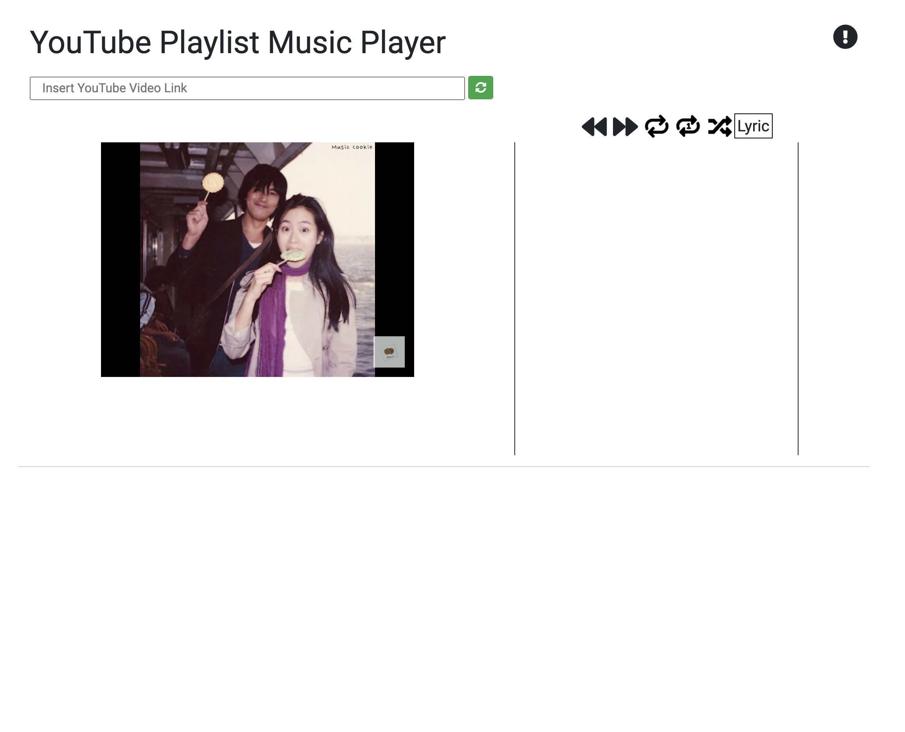
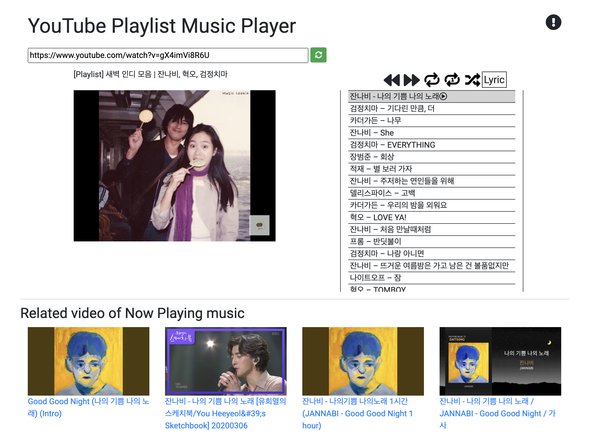

# CS459 Project

Taeyun Woo Youtube Playlist video Player

 

*In this file, the firebase and google APIs(YouTube Data, ifrmae, Google Custom Search) are blank. Thus, if you want to use this service, you have to type your ***own*** api key.

-------

<h3>Motivation</h3>
In YouTube, there are so many playlists that mash-up several musics into one video.
However, YouTube is the video web-site for watching the video, not the listening the music.
So, I want to implement a web-site good for listening the music with YouTube Playlist video.

-------

<h3>How to Use?</h3>

At first,

You can see this image.

Then, type the YouTube Playlist Video link to input

Then you can see like above image.

<h2>Enjoy this!</h2>
